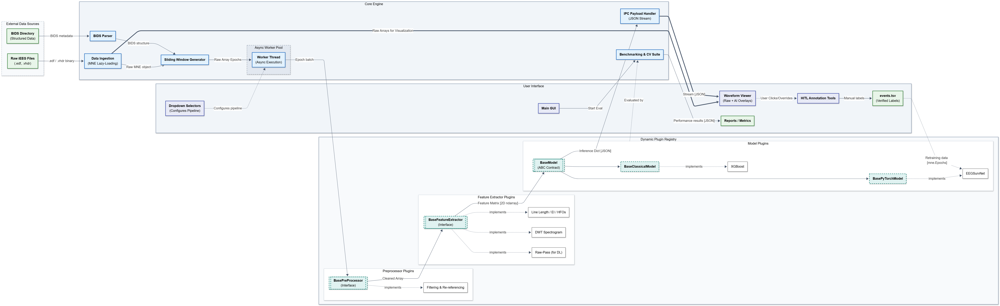
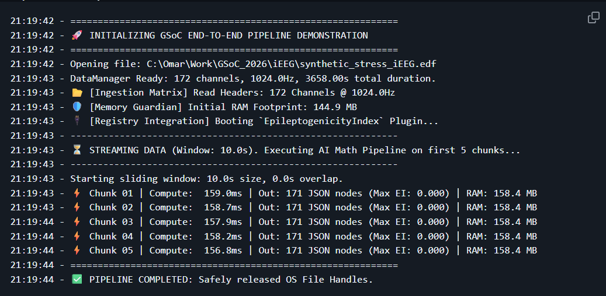

# iEEG Backend: Plugin-Based Pipeline for Clinical Intracranial EEG

A Python backend that streams **multi-gigabyte intracranial EEG (iEEG) recordings in constant memory**. It runs drop-in feature and model plugins over sliding windows and returns JSON-safe results to a GUI.

> **Status:** Working prototype built for my INCF Google Summer of Code 2026 proposal (Project 21). The proposal was not selected, and the reviewer called it very competitive. The data engine, plugin contracts, PyTorch adapter and one clinical feature plugin are implemented and tested. The async workers, GUI bridge and benchmarking suite are designed but **not yet implemented**. They're marked *(planned)* below.



**Highlights**
- Streamed a **1.2 GB, 172-channel EDF in ~150 MB of RAM** (lazy MNE reads + a generator-based sliding window).
- **100% test coverage** on the data engine, with pytest edge cases for zero-length windows, negative overlap, out-of-bounds reads and end-of-file truncation.
- **Open/closed plugin architecture:** researchers drop in preprocessors, features or models that implement ABC contracts, and the contract tests enforce compliance.
- **IPC-safe outputs:** tests guarantee that no `numpy.ndarray` or `torch.Tensor` objects leak into the JSON sent to the UI thread.

## 📂 Project Architecture

The codebase strictly adheres to OOP and SOLID principles to guarantee maintainability and seamless GUI integration:

```text
ieeg_backend/
├── README.md                   # Project overview, installation, and plugin guide
├── pyproject.toml              # Python build system configuration
├── requirements.txt            # Explicit dependency locking (e.g., torch, mne)
├── .gitignore                  # Excludes heavy clinical workspace data
│
├── src/                        # Immutable source code (Python package root)
│   ├── core/                   # Core pipeline engine (Closed for modification)
│   │   ├── interfaces.py       # Pure ABC contracts (BasePreProcessor, BaseModel)
│   │   ├── base_models/        # Framework adapters (PyTorch/Sklearn wrappers)
│   │   │   ├── base_pytorch.py
│   │   │   └── base_classical.py   # (planned)
│   │   ├── data_manager.py     # MNE lazy-loading and BIDS parsing
│   │   ├── sliding_window.py   # Continuous data chunking generator
│   │   ├── dynamic_loader.py   # (planned) importlib scanner for plugins/
│   │   └── async_workers.py    # (planned) process pool for non-blocking execution
│   │
│   ├── bridge/                 # (planned) GUI integration layer (IPC)
│   │   ├── __init__.py
│   │   ├── event_handlers.py   # Receives execution triggers from the frontend
│   │   └── schemas.py          # Pydantic models enforcing JSON payload structure
│   │
│   └── benchmarking/           # (planned) clinical evaluation suite
│       ├── __init__.py
│       ├── cross_validator.py  # Grouped patient-level cross-validation
│       └── metric_calculator.py# Metrics robust to class imbalance (PR-AUC, F1)
│
├── plugins/                    # Dynamic Registry (Open for extension)
│   ├── preprocessors/          # Drop-in cleaning algorithms (Notch, Bipolar)
│   ├── features/               # epileptogenicity_index.py (implemented); HFO, DWT planned
│   └── models/                 # Drop-in inference scripts (EEGSurvNet, XGBoost)
│
├── workspace/                  # Local clinical data outputs (Git-ignored)
│   ├── derivatives/            # Standardized BIDS events.tsv (HITL annotations)
│   └── reports/                # Exported benchmarking JSONs and clinical PDFs
│
├── weights/                    # Heavy serialized model weights (Git-ignored)
│   └── eegsurvnet_v1.pt
│
├── tests/                      # Pytest Suite
│   ├── test_sliding_window.py
│   ├── test_data_manager.py
│   ├── test_feature_extractors.py
│   ├── test_memory_profiling.py
│   └── test_contracts.py       # Enforces plugin compliance with ABC rules
│
└── demo_full_pipeline.py       # End-to-end demo: DataManager → windows → EI plugin
```

## Current Implementation Status

**Data Ingestion Engine**.

- **`data_manager.py`**: A robust OOP wrapper that reads massive iEEG files using memory pointers (via `mne.io.read_raw(preload=False)`). Includes validation mapping exact neural channels (`eeg`, `seeg`, `ecog`) using `mne.pick_types`, preventing runtime failures from inconsistent hospital naming schemes. It leverages a Python Context Manager to lock/unlock OS file handles.
- **`sliding_window.py`**: A Python Generator that ingests the `DataManager` stream and slices it into $O(1)$ memory chunks using configurable offsets. It eliminates end-of-file truncation by dynamically calculating duration limits.
- **The Pipeline**: Together, the `DataManager` pulls metadata and passes it to the `SlidingWindowGenerator`, which invokes `get_window()` to stream isolated arrays from the disk *only* when the memory loop yields.

### Asynchronous GUI integration (IPC): planned

The design runs inference in a separate process pool so the UI never freezes: it chunks data with `sliding_window.py`, runs the plugins, and yields lightweight JSON payloads back to the main thread. The JSON-safety guarantees are already enforced by the tests; the process pool itself is not yet built.

## Testing Results

The data ingestion pipeline was tested for edge-case validation and memory profiling. 

- **Unit Tests (100% Coverage)**: The modules pass `pytest` with **100% coverage** over the core modules. The dynamic assertions lock down zero-length windows, negative overlap parameters, out-of-bounds duration requests, and end-of-file truncation.

<details>
<summary><strong>Expand to see Pytest output</strong></summary>

```text
============================= test session starts =============================

tests/test_data_manager.py::test_initialization PASSED                   [ 14%]
tests/test_data_manager.py::test_context_manager PASSED                  [ 28%]
tests/test_data_manager.py::test_get_window_valid PASSED                 [ 42%]
tests/test_data_manager.py::test_get_window_exceeds_duration PASSED      [ 57%]
tests/test_data_manager.py::test_get_window_invalid PASSED               [ 71%]
tests/test_sliding_window.py::test_initialization_invalid PASSED         [ 85%]
tests/test_sliding_window.py::test_generate_loop PASSED                  [100%]

=============================== tests coverage ================================

Name                         Stmts   Miss  Cover   Missing
----------------------------------------------------------
src\core\data_manager.py        39      0   100%
src\core\sliding_window.py      27      0   100%
----------------------------------------------------------
TOTAL                           66      0   100%
============================== 7 passed in 1.67s ==============================
```
</details>

- **1.2GB .edf Test**: The pipeline executed on a 1.2GB `.edf` file, generating chunks for 172 data channels.
- **RAM Resilience**: The RAM consumption stabilized at `~147 MB`. During disk-read bursts, memory spiked but immediately compressed back down to exactly `147 MB` via aggressive garbage collection (`gc.collect()`), avoiding the risk of memory overflow regardless of recording length.

## 🔢 Deterministic Plugin Verification (Epileptogenicity Index)

To ensure clinical plugins behave predictably before being ingested by inference models or the GUI, the pipeline enforces mathematical strictness. The `EpileptogenicityIndex` plugin executes a 4-stage deterministic feature extraction (Spatial Referencing -> Spectral Power -> CUSUM -> Normalization).

- **Dynamic Edge-Cases Prevented**: The Pytest suite rigorously validates that short streaming array windows will dynamically down-scale SciPy FFT (`nperseg`) to prevent instant segfaults.
- **Serialization Isolation**: The test proves the returned feature metrics contain absolutely **zero** `numpy.ndarray` vectors, ensuring pure JSON synchronization when moving output back into the GUI thread.

<details>
<summary><strong>Expand to see Pytest output</strong></summary>

```text
============================= test session starts =============================

tests/test_feature_extractors.py::test_epileptogenicity_index_extraction PASSED [100%]

============================== 1 passed in 5.21s ==============================
```
</details>

## AI Inference & Hardware Sandboxing Validation

To guarantee prototype functionality, a Pytest suite was implemented that tests the plugin registry. The suite proves that:

- **Hardware Sandboxing**: The `BasePyTorchModel` wrapper successfully disables the computational graph (`requires_grad == False`) during continuous execution, ensuring an $O(1)$ VRAM footprint.
- **IPC Safety**: It enforces strict Type-checking on researcher plugins, guaranteeing that absolutely **zero** `torch.Tensor` objects leak into the JSON payload bound for the asynchronous UI thread.
- **Dimensionality Automation**: It verifies the wrapper automatically expands the batch dimension (`unsqueeze(0)`) for 2D sliding windows, preventing pipeline crashes.

<details>
<summary><strong>Expand to see Pytest output</strong></summary>

```text
============================= test session starts =============================

tests/test_contracts.py::test_contract_enforcement PASSED                [ 33%]
tests/test_contracts.py::test_vram_leak_prevention PASSED                [ 66%]
tests/test_contracts.py::test_gui_serialization_safety PASSED            [100%]

=============================== tests coverage ================================

Name                                   Stmts   Miss  Cover   Missing
--------------------------------------------------------------------
src\core\base_models\base_pytorch.py      36      5    86%   21, 23, 33, 44, 74
src\core\interfaces.py                     7      1    86%   24
--------------------------------------------------------------------
TOTAL                                     43      6    86%
============================== 3 passed in 1.80s ==============================
```
</details>

> **Note on Coverage**: 86% as the 5 omitted lines represent incompatible hardware branches (e.g. Apple Silicon `mps` or `cuda` fallbacks) skipped during local execution, alongside structural `NotImplementedError` stubs enforced by the `BaseModel` abstract interface.

## 🚀 End-to-End Prototype Demonstration

To prove the architectural pipeline is fully realized, the backend was executed against a continuous 1.2GB EDF file. 

A script was implemented that initializes the `DataManager`, unpacks the `SlidingWindowGenerator`, passes the sample rates to the `EpileptogenicityIndex` feature extractor plugin, and dynamically streams and processes high-frequency data within a pure $O(1)$ memory constraint.

<details>
<summary><strong>Expand to see Pipeline Terminal Execution</strong></summary>

```text
21:19:42 - ============================================================
21:19:42 - 🚀 INITIALIZING GSoC END-TO-END PIPELINE DEMONSTRATION
21:19:42 - ============================================================
21:19:42 - Opening file: C:\Omar\Work\GSoC_2026\iEEG\synthetic_stress_iEEG.edf
21:19:43 - DataManager Ready: 172 channels, 1024.0Hz, 3658.00s total duration.
21:19:43 - 📂 [Ingestion Matrix] Read Headers: 172 Channels @ 1024.0Hz
21:19:43 - 🛡️ [Memory Guardian] Initial RAM Footprint: 144.9 MB
21:19:43 - 🔌 [Registry Integration] Booting `EpileptogenicityIndex` Plugin...
21:19:43 - ------------------------------------------------------------
21:19:43 - ⏳ STREAMING DATA (Window: 10.0s). Executing AI Math Pipeline on first 5 chunks...
21:19:43 - ------------------------------------------------------------
21:19:43 - Starting sliding window: 10.0s size, 0.0s overlap.
21:19:43 - ⚡ Chunk 01 | Compute:  159.0ms | Out: 171 JSON nodes (Max EI: 0.000) | RAM: 158.4 MB
21:19:43 - ⚡ Chunk 02 | Compute:  158.7ms | Out: 171 JSON nodes (Max EI: 0.000) | RAM: 158.4 MB
21:19:44 - ⚡ Chunk 03 | Compute:  157.9ms | Out: 171 JSON nodes (Max EI: 0.000) | RAM: 158.4 MB
21:19:44 - ⚡ Chunk 04 | Compute:  158.2ms | Out: 171 JSON nodes (Max EI: 0.000) | RAM: 158.4 MB
21:19:44 - ⚡ Chunk 05 | Compute:  156.8ms | Out: 171 JSON nodes (Max EI: 0.000) | RAM: 158.4 MB
21:19:44 - ============================================================
21:19:44 - ✅ PIPELINE COMPLETED: Safely released OS File Handles.
```
</details>


## Run it
```bash
pip install -r requirements.txt
pytest --cov=src                      # unit + contract tests
python demo_full_pipeline.py          # needs an .edf file; path set at the top of the script
```

## Tech
`Python` · `MNE-Python` · `NumPy/SciPy` · `PyTorch` · `pytest` + `pytest-cov` · ABC/adapter patterns · generators
